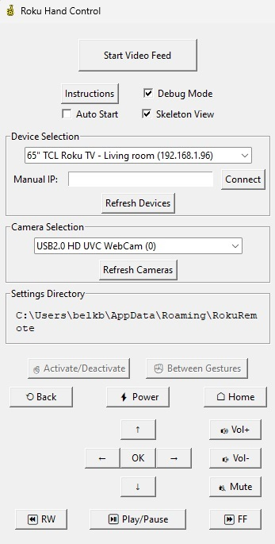
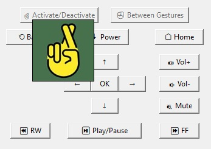
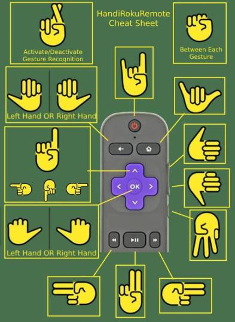

# Handi Roku Remote
[Link to Windows Download](https://github.com/BBelk/HandiRokuRemote/releases/tag/v1)
## Table of contents
1. [Description](#description)
2. [How It Works](#how-it-works)
3. [Installation and Interface Overview](#installation-and-interface-overview)
4. [Gestures and Commands](#gestures-and-commands)
5. [Limitations](#limitations)
6. [Potential Future Developent](#potential-future-development)

## Description
Handi Roku Remote allows you to control your Roku device using hand gestures. The application automatically connects to devices on your local network, gathers a list of available cameras connected to your computer, and tracks a hand to translate gestures into commands sent to Roku's External Control Protocol (ECP). 

## How It Works
This project uses [Google's Mediapipe](https://github.com/google-ai-edge/mediapipe) [Hand Landmark Detector](https://ai.google.dev/edge/mediapipe/solutions/vision/hand_landmarker) for real-time hand tracking. It identifies keypoints on the palm and fingers, evaluates their positions and orientations, and determines the user's gesture. The recognized gesture is then translated into a command sent to the Roku device through its ECP interface.

The application is built using Python and leverages several libraries:

• Tkinter for the graphical user interface.

• OpenCV for video capture and display.

• Requests for HTTP communication to discover devices and send commands.

## Installation and Interface Overview
If you've already got the program running, skip ahead to the [Gestures and Commands](#gestures-and-commands) section.

### System Requirements
• Operating System: Windows

• Camera: Any built-in camera or USB camera should work

• Roku Device: Connected to the same local network as the computer running this program

### Installation
• [Download](https://github.com/BBelk/HandiRokuRemote/releases/tag/v1) the latest version of the .exe

• Place the .exe file anywhere on your computer

• Double-click HandiRokuRemote.exe to launch the applicaiton

### Interface Overview

Upon launching the applicaiton, you will see the main window:

### Video Feed Controls
• Start Video Feed: Begins capturing video from the selected camera. The feed appears on the right side of the window.

• Stop Video Feed: Halts the video capture.

### Settings
• Debug Mode: Displays additional information such as finger extension status and base distance. Useful for troubleshooting.

• Auto Start: Automatically starts the video feed with the selected options when the application launches.

• Skeleton View: Overlays landmarks and connections on the hand image for visual feedback.

### Device Selection
• Automatic Discovery: The application attempts to discover Roku devices on your local network. Select your device from the dropdown list.

• Manual IP Entry: If your device is not found, you can enter its IP address manually. To find your Roku's IP address, navigate on your Roku device to Settings > Network > About.

### Camera Selection
• Select Camera: Choose the camera you wish to use for gesture detection from the dropdown list.

• Refresh Cameras: Updates the list of available cameras if you connect a new one.
### Settings Directory
Displays the location of configuration and log files used by the application:

• roku_config.json: Stores settings and discovered devices for easier access.

• roku_remote.log: Contains logs that can be used for troubleshooting.

### Navigation Buttons
These buttons simulate a Roku remote and can be clicked to send commands directly to your Roku device. Hover over each button to see a tooltip that shows the corresponding gesture.

## Gestures and Commands
Once you've got the Video Feed started, on your right you will see your camera's view. In the top right of the camera view, you should see text saying either "Idle" or "Active". Idle mode is triggered when a hand is not currently being tracked for gesture recognition. Note that only one hand is tracked at a time.

To activate gesture recognition, cross your index finger over your middle finger, keeping the tips relatively close. This is the letter 'R' in American sign language (get it, R for Roku?). Now the program is 'Active' and detecting gestures on the hand. Between each gesture, you must make a fist. Once a fist is made, you can then perform another gesture, and the program sends the command. To stop tracking, you can either perform the 'R' gesture again, or simply hide the hand from the camera's view.

Here is a cheatsheet of gestures mapped to Roku commands:

Note: The direction in which you point your fingers determines the command for certain gestures, especially for navigation and media control.

### Pro-Tips:

• Lighting: Ensure you hand is well lit and avoid presenting the hand with a similar skin tone behind it

• Distance: Keep within 2 meters of the camera for optimal tracking

• Steady Gestures: The application waits for a gesture to be held for 1/3rd of a second before recognition occours

## Limitations
Overall I am pretty pleased with the project. Mediapipe is incredibly powerful but unfortunately, it's not magic. It struggles detecting far away hands; I can get about 2 meters away before the illusion fails. This is just fine for playing with on a regular computer directly in front of you. But in a hypothetical scenario where you'd want to shove this on a raspberry pi and mount it on top of your TV, a method for detecting visually smaller hands would be necessary.

## Potential Future Development
There are multiple avenues for continued development. Creating a further-away hand-landmark detector or gesture detector is a relatively straight-forward process (provided you have a few thousand annotated images of hands). I originally wanted to slap this on a raspberry pi but the distance limits on hand detection threatened to turn this side-side project into a real side-project.

This project's Roku specific code could be modified or further extended to work with specific Smart TVs or any TV that supports HDMI-CEC (Consumer Electronics Control). Really, the sky is the limit. If TV manufacturers aren't already experimenting with this kind of tech then they're missing out, it's a lot of fun!

## Thanks To
[OpenMoji](https://openmoji.org/) for the great free emojis!